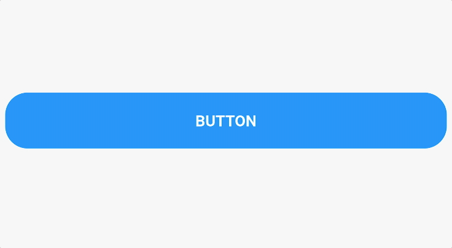

# Flutter widgets library

## Getting started

To add a widget to your app:

1. Add this to your `pubspec.yaml` file.

    ```yaml
    dependencies:
      fade_button:
        git:
          url: git@github.com:HTD-Health/flutter_widgets_library.git
          path: packages/fade_button
    ```
2. You are ready! 😉

***
## [spring_loader](./packages/spring_loader)

  
To add a widget to your app:
```yaml
dependencies:
    spring_loader:
    git:
        url: git@github.com:HTD-Health/flutter_widgets_library.git
        path: packages/spring_loader
```

## [dots_loader](./packages/dots_loader)

  
To add a widget to your app:
```yaml
dependencies:
    dots_loader:
    git:
        url: git@github.com:HTD-Health/flutter_widgets_library.git
        path: packages/dots_loader
```

## [fade_button](./packages/fade_button)
A widget that provides a fade effect when a tap gesture is performed on its child.  

  
To add a widget to your app:
```yaml
dependencies:
    fade_button:
    git:
        url: git@github.com:HTD-Health/flutter_widgets_library.git
        path: packages/fade_button
```