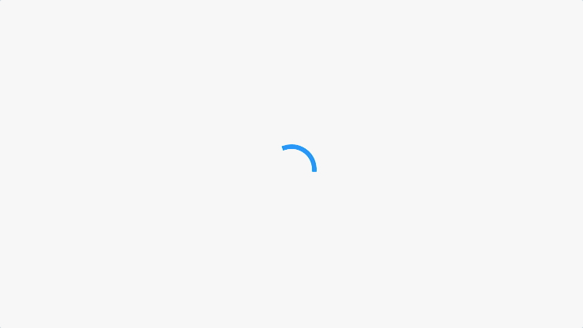
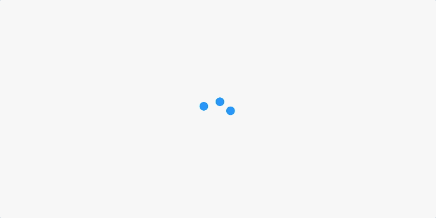
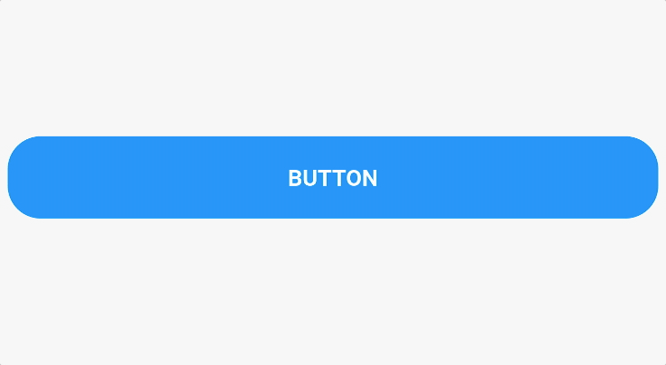

# Flutter widgets library
- [Flutter widgets library](#flutter-widgets-library)
  - [Getting started](#getting-started)
  - [Loaders](#loaders)
    - [`SpringLoader`](#springloader)
    - [`CircleLoader`](#circleloader)
    - [`DotsLoader`](#dotsloader)
  - [Buttons](#buttons)
    - [`FadeButton`](#fadebutton)
  - [Layouts](#layouts)
    - [`SeparatedChildBuilderDelegate`](#separatedchildbuilderdelegate)
      - [Example:](#example)
  - [Async](#async)
    - [`AsyncCallbackBuilder`](#asynccallbackbuilder)

***

## Getting started

To add a widget to your app:

1. Add this to your `pubspec.yaml` file.

    ```yaml
    dependencies:
      widgets_library:
        git: git@github.com:HTD-Health/flutter_widgets_library.git
    ```
2. You are ready! 😉

***

## Loaders
### `SpringLoader`

  

### `CircleLoader`

  

### `DotsLoader`

  

## Buttons

### `FadeButton`
A widget that provides a fade effect when a tap gesture is performed on its child.  

  

## Layouts

### `SeparatedChildBuilderDelegate`
This delegate can be used together with `SliverList` to provide a solution similar to `ListView.separated`.

#### Example:
```dart
class SeparatedChildBuilderDelegateExample extends StatelessWidget {
  @override
  Widget build(BuildContext context) {
    final items = ['item 1', 'item 2', 'item 3'];

    return CustomScrollView(
      slivers: [
        SliverList(
          delegate: SeparatedChildBuilderDelegate(
            childCount: items.length,
            itemBuilder: (BuildContext context, int index) => Text(items[index]),
            separatorBuilder: (BuildContext context, int index) => const SizedBox(height: 24),
          )
        )
      ],
    );
  }
}
```

## Async

### `AsyncCallbackBuilder`
A widget that encapsulates asynchronously running procedures with automatic state updates.
